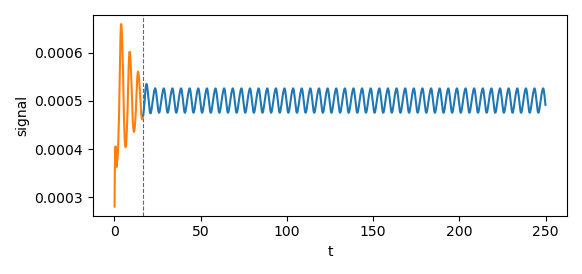
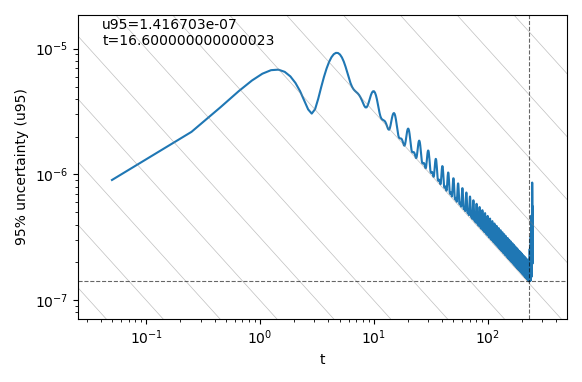

# pyTST


[](https://doi.org/10.5281/zenodo.4428158)


This module performs the "Transient Scanning Technique" presented in:

* Brouwer, J., Tukker, J., & van Rijsbergen, M. (2013). Uncertainty Analysis of Finite Length Measurement Signals. 3rd International Conference on Advanced Model Measurement Technology for the EU Maritime Industry. [[PDF]](https://www.researchgate.net/profile/Joris_Brouwer/publication/295702719_Uncertainty_Analysis_of_Finite_Length_Measurement_Signals/links/56cc943e08ae059e375067d9/Uncertainty-Analysis-of-Finite-Length-Measurement-Signals.pdf)
       
* Brouwer, J., Tukker, J., & van Rijsbergen, M. (2015). Uncertainty Analysis and Stationarity Test of Finite Length Time Series Signals. 4th International Conference on Advanced Model Measurement Technology for the Maritime Industry. [[PDF]](https://www.researchgate.net/profile/Joris_Brouwer/publication/295694401_Uncertainty_Analysis_and_Stationarity_Test_of_Finite_Length_Time_Series_Signals/links/56cc7e2208ae96cdd071bb92/Uncertainty-Analysis-and-Stationarity-Test-of-Finite-Length-Time-Series-Signals.pdf)

* Brouwer, J., Tukker, J., Klinkenberg, Y., & van Rijsbergen, M. (2019). Random uncertainty of statistical moments in testing: Mean. Ocean Engineering, 182(April), 563–576. https://doi.org/10.1016/j.oceaneng.2019.04.068

It allows to easily detect transient portion of a signal and mesure the statistical uncertainty with that portion removed.

<p align="center">
    
    
</p>


## Install
Can be installed like any python package, for example:
``` sh
pip3 install --user https://github.com/WavEC-Offshore-Renewables/pyTST/archive/master.zip
```


## Usage
This package provides both a command line tool as well as a python library (for more flexibility).  

### Command line
If the signal data looks like:
```
# time   signal
  1     0.280910708014E-03 
  2     0.280910708014E-03
  3     0.345576259768E-03
...
```

the following can be used

``` sh
TST-cli --time-col=0 --signal-col=1 example_data_filename
```
   
See `TST-cli -h` for more details on the capabilities.

### Python library
Signal data can be loaded from a file:
``` python
from pyTST import pyTST

tst = pyTST()

tst.load_data_file("example_data_filename", signal_column=1, time_column=0, tstep=0.05)

tst.compute_TST(step_size=10)
tst.export_to_txt("TST_analysis.dat")
# tst.import_from_txt("TST_analysis.dat")
tst.plot()
```

Or provided via python arrays:
``` python
import numpy as np
from pyTST import pyTST

# Signal creation
t = np.linspace(1,1000, 5000)

signal = np.sin(t)

# Add initial transiant effect
signal[0:100] += np.linspace(1,0, 100)


tst = pyTST()
tst.load_data_array(signal_array=signal, time_array=t)

tst.compute_TST(step_size=10)
tst.export_to_txt("TST_analysis.dat")
# tst.import_from_txt("TST_analysis.dat")
tst.plot()
```

For more info, the library is documented via docstrings:
``` python
from pyTST import pyTST
help(pyTST)
```

# How to cite?
This code can be cited with:
```
@software{lemaire_sebastien_2021_4428158,
  author       = {Lemaire, Sébastien and
                  Klapwijk, Maarten},
  title        = {pyTST},
  month        = jan,
  year         = 2021,
  publisher    = {Zenodo},
  version      = {v1.0},
  doi          = {10.5281/zenodo.4428158},
  url          = {https://doi.org/10.5281/zenodo.4428158}
}
```
